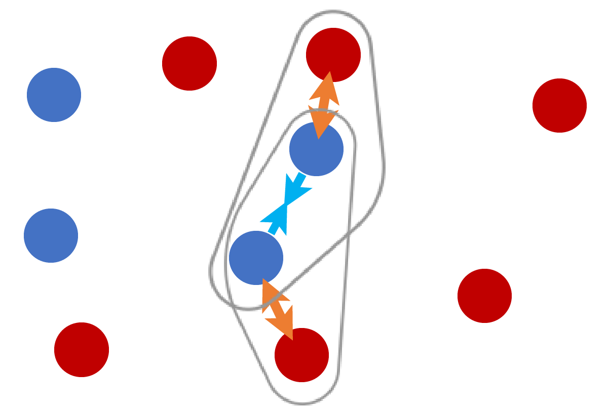
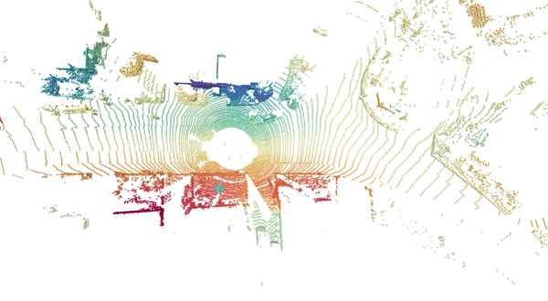
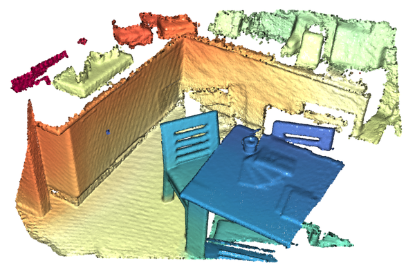
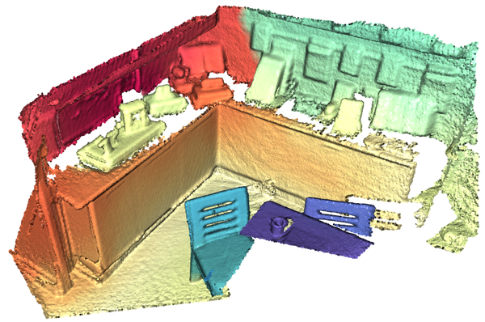
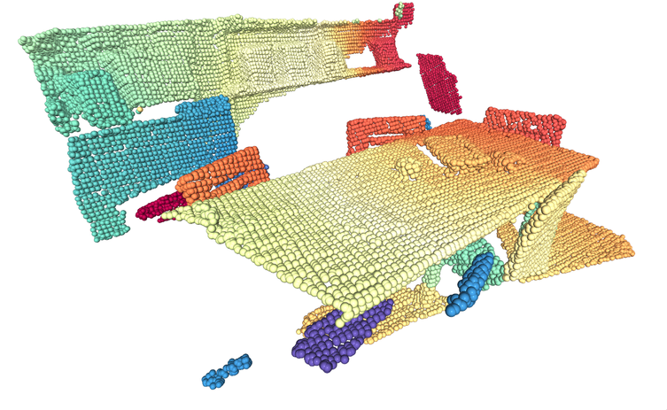

# Fully Convolutional Geometric Features, ICCV, 2019

Extracting geometric features from 3D scans or point clouds is the first step in applications such as registration, reconstruction, and tracking. State-of-the-art methods require computing low-level features as input or extracting patch-based features with limited receptive field. In this work, we present fully-convolutional geometric features, computed in a single pass by a 3D fully-convolutional network. We also present new metric learning losses that dramatically improve performance. Fully-convolutional geometric features are compact, capture broad spatial context, and scale to large scenes. We experimentally validate our approach on both indoor and outdoor datasets. Fully-convolutional geometric features achieve state-of-the-art accuracy without requiring prepossessing, are compact (32 dimensions), and are 600 times faster than the most accurate prior method.

[ICCV'19 Paper](https://node1.chrischoy.org/data/publications/fcgf/fcgf.pdf)


## 3D Feature Accuracy vs. Speed


*Feature-match recall and speed in log scale on the 3DMatch benchmark. Our approach is the most accurate and the fastest. The gray region shows the Pareto frontier of the prior methods.*


### Related Works

3DMatch by Zeng et al. uses a siamese convolutional network to learn 3D patch descriptors.
CGF by Khoury et al. maps 3D oriented histograms to a low-dimensional feature space using multi-layer perceptrons. PPFNet and PPF FoldNet by Deng et al. adapts the PointNet architecture for geometric feature description. 3DFeat by Yew and Lee uses a PointNet to extract features in outdoor scenes.

Our work addressed a number of limitations in the prior work. First, all prior approaches extract a small 3D patch or a set of points and map it to a low-dimensional space. This not only limits the receptive field of the network but is also computationally inefficient since all intermediate representations are computed separately even for overlapping 3D regions. Second, using expensive low-level geometric signatures as input can slow down feature computation. Lastly, limiting feature extraction to a subset of interest points results in lower spatial resolution for subsequent matching stages and can thus reduce registration accuracy.


### Fully Convolutional Metric Learning  and Hardest Contrastive, Hardest Triplet Loss

Traditional metric learning assumes that the features are independent and identically distributed (i.i.d.) since a batch is constructed by random sampling. However, in fully-convolutional feature extraction, adjacent features are locally correlated. Thus, hard-negative mining could find features adjacent to anchors, and they are false negatives. Thus, filtering out the false negatives is crucial similar to how Universal Correspondence Network by Choy et al. used a distance threshold.

Also, the number of features used in the fully-convolutional setting is orders of magnitude larger than in standard metric learning algorithms. For instance, FCGF generates ~40k features for a pair of scans (this increases proportionally with the batch size) while a minibatch in traditional metric learning has around 1k features. Thus, it is not feasible to use all pairwise distances within a batch as in standard metric learning.

To speed up the fully-convolutional feature learning, we propose hardest contrastive loss and hardest triplet loss. Visually, these are simple variants that use the hardest negatives for both of points within a positive pair.
One of the key advantages of the hardest-contrastive loss is that you do not need to save the temporary variables used to find the hardest negatives. This allows finding hardest negatives among a large number of feature. [Here](https://github.com/chrischoy/open-ucn/blob/master/lib/ucn_trainer.py#L435), we used almost 40k features to mine the hardest negative and free all intermediate variables once the indices of the hardest negatives are found.

| Contrastive Loss   | Triplet Loss       | Hardest Contrastive | Hardest Triplet    |
|:------------------:|:------------------:|:-------------------:|:------------------:|
|  |  |   |  |

*Sampling and negative-mining strategy for each method. Blue: positives, Red: Negatives. Traditional contrastive and triplet losses use random sampling. Our hardest-contrastive and hardest-triplet losses use the hardest negatives.*

Please refer to our [ICCV'19 paper](https://node1.chrischoy.org/data/publications/fcgf/fcgf.pdf) for more details.


### Visualization of FCGF

We color-coded FCGF features for pairs of 3D scans that are 10m apart for KITTI and a 3DMatch benchmark pair for indoor scans. FCGF features are mapped to a scalar space using t-SNE and colorized with the Spectral color map.

| KITTI LIDAR Scan 1   | KITTI LIDAR Scan 2   |
|:--------------------:|:--------------------:|
|  |  |

| Indoor Scan 1              | Indoor Scan 2              |
|:--------------------------:|:--------------------------:|
|  |  |


## Requirements

- Ubuntu 14.04 or higher
- CUDA 10.0 or higher
- Python v3.7 or higher
- Pytorch v1.2 or higher
- [MinkowskiEngine](https://github.com/stanfordvl/MinkowskiEngine) v0.2.7 or higher


## Installation & Dataset Download


We recommend conda for installation. First, follow the [MinkowskiEngine installation instruction](https://github.com/stanfordvl/MinkowskiEngine) to setup the environment and the Minkowski Engine.

Next, download FCGF git repository and install the requirement from the FCGF root directory..

```
git clone https://github.com/chrischoy/FCGF.git
cd FCGF
# Do the following inside the conda environment
pip install -r requirements.txt
```

For training, download the preprocessed 3DMatch benchmark dataset.

```
./scripts/download_datasets.sh /path/to/dataset/download/dir
```

For KITTI training, follow the instruction on [KITTI Odometry website](http://www.cvlibs.net/datasets/kitti/eval_odometry.php) to download the KITTI odometry training set.


## Demo: Extracting and color coding FCGF

After installation, you can run the demo script by

```
python demo.py
```

The demo script will first extract FCGF features from a mesh file generated from a kitchen scene. Next, it will color code the features independent of their spatial location.
After the color mapping using TSNE, the demo script will visualize the color coded features by coloring the input point cloud.



*You may have to rotate the scene to get the above visualization.*


## Training and running 3DMatch benchmark

```
python train.py --threed_match_dir /path/to/threedmatch/
```

For benchmarking the trained weights on 3DMatch, download the 3DMatch Geometric Registration Benchmark dataset from [here](http://3dmatch.cs.princeton.edu/) and follow:

```
python -m scripts.benchmark_3dmatch.py \
    --source /path/to/threedmatch \
    --target ./features_tmp/ \
    --voxel_size 0.025 \
    --model ~/outputs/checkpoint.pth \
    --do_generate --do_exp_feature --with_cuda
```

## Model Zoo

| Model       | Normalized Feature  | Dataset | Voxel Size | Feature Dimension | Performance              | Link   |
|:-----------:|:-------------------:|:-------:|:----------:|:-----------------:|:------------------------:|:------:|
| ResUNetBN2C | True                | 3DMatch | 2.5cm      | 32                | FMR: 0.9578 +- 0.0272    | [download](https://node1.chrischoy.org/data/publications/fcgf/2019-08-19_06-17-41.pth) |
| ResUNetBN2C | True                | 3DMatch | 2.5cm      | 16                | FMR: 0.9442 +- 0.0345    | [download](https://node1.chrischoy.org/data/publications/fcgf/2019-09-18_14-15-59.pth) |
| ResUNetBN2C | True                | 3DMatch | 5cm        | 32                | FMR: 0.9372 +- 0.0332    | [download](https://node1.chrischoy.org/data/publications/fcgf/2019-08-16_19-21-47.pth) |
| ResUNetBN2C | False               | KITTI   | 20cm       | 32                | RTE: 0.0534, RRE: 0.1704 | [download](https://node1.chrischoy.org/data/publications/fcgf/2019-07-31_19-30-19.pth) |
| ResUNetBN2C | False               | KITTI   | 30cm       | 32                | RTE: 0.0607, RRE: 0.2280 | [download](https://node1.chrischoy.org/data/publications/fcgf/2019-07-31_19-37-00.pth) |


## Citing FCGF

FCGF will be presented at ICCV'19: Friday, November 1, 2019, 1030–1300 Poster 4.1 (Hall B)

```
@inproceedings{FCGF2019,
    author = {Christopher Choy and Jaesik Park and Vladlen Koltun},
    title = {Fully Convolutional Geometric Features},
    booktitle = {ICCV},
    year = {2019},
}
```

## Acknowledgements

We want to thank all the ICCV reviewers, especially R2, for suggestions and valuable pointers.


## Related Projects

- [Minkowski Engine](https://github.com/StanfordVL/MinkowskiEngine)
- [4D Spatio Temporal Semantic Segmentation](https://github.com/chrischoy/SpatioTemporalSegmentation)


## Projects using FCGF

- [Learning multiview 3D point cloud registration](https://arxiv.org/abs/2001.05119)
