# Fully Convolutional Geometric Features, ICCV, 2019

Extracting geometric features from 3D scans or point clouds is the first step in applications such as registration, reconstruction, and tracking. State-of-the-art methods require computing low-level features as input or extracting patch-based features with limited receptive field. In this work, we present fully-convolutional geometric features, computed in a single pass by a 3D fully-convolutional network. We also present new metric learning losses that dramatically improve performance. Fully-convolutional geometric features are compact, capture broad spatial context, and scale to large scenes. We experimentally validate our approach on both indoor and outdoor datasets. Fully-convolutional geometric features achieve state-of-the-art accuracy without requiring prepossessing, are compact (32 dimensions), and are 600 times faster than the most accurate prior method.

[ICCV'19 Paper](https://node1.chrischoy.org/data/publications/fcgf/fcgf.pdf)

## News

- 2026-07-02 FCGF now runs on **[WarpConvNet](https://github.com/NVlabs/WarpConvNet)** instead of MinkowskiEngine. The maintained code path lives under `wcn/` and installs from a prebuilt wheel (no compilation). The original MinkowskiEngine checkpoints still work — convert them once with `wcn/convert_me_to_wcn.py`. See the [WarpConvNet backend](#warpconvnet-backend) section.
- 2020-10-02 Measure the FCGF speedup on v0.5 on [MinkowskiEngineBenchmark](https://github.com/chrischoy/MinkowskiEngineBenchmark). The speedup ranges from 2.7x to 7.7x depending on the batch size.
- 2020-09-04 Updates on ME v0.5 further speed up the inference time from 13.2ms to 11.8ms. As a reference, ME v0.4 takes 37ms.
- 2020-08-18 Merged the v0.5 to the master with v0.5 installation. You can now use the full GPU support for sparse tensor hi-COO representation for faster training and inference.
- 2020-08-07 [MinkowskiEngine](https://github.com/NVIDIA/MinkowskiEngine) v0.5 improves the **FCGF inference speed by x2.8** (280% speed-up, feed forward time for ResUNetBN2C on the 3DMatch kitchen point cloud ID-20: 37ms (ME v0.4.3) down to 13.2ms (ME v0.5.0). Measured on TitanXP, Ryzen-3700X).
- 2020-06-15 [Source code](https://github.com/chrischoy/DeepGlobalRegistration) for **Deep Global Registration, CVPR'20 Oral** has been released. Please refer to the repository and the paper for using FCGF for registration.

## 3D Feature Accuracy vs. Speed

|   Comparison Table           | Speed vs. Accuracy |
|:----------------------------:|:------------------:|
| 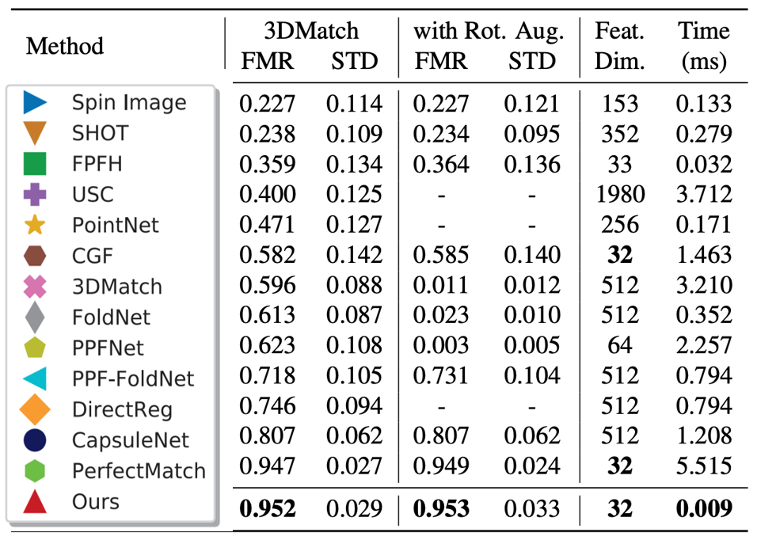   | 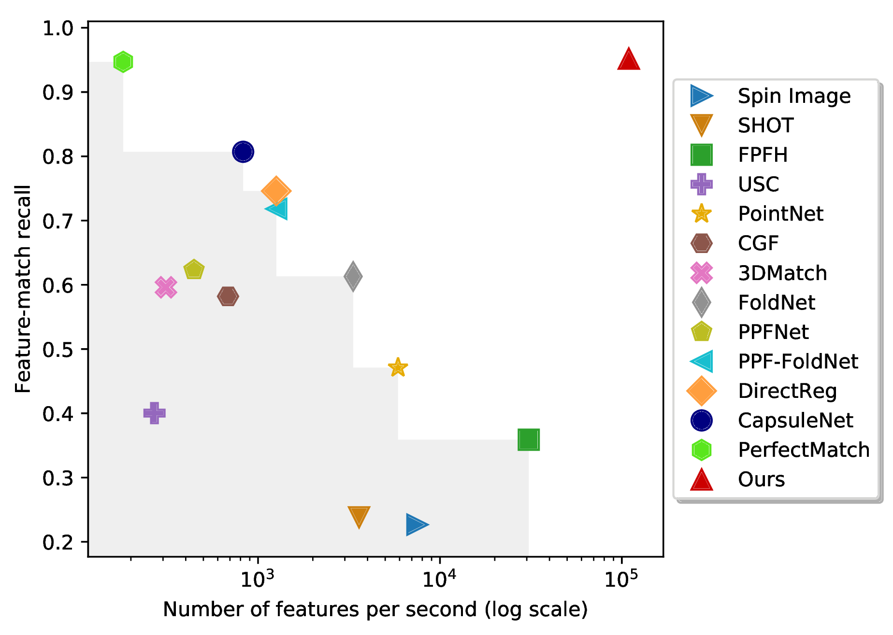 |

*Feature-match recall and speed in log scale on the 3DMatch benchmark. Our approach is the most accurate and the fastest. The gray region shows the Pareto frontier of the prior methods.*


### Related Works

3DMatch by Zeng et al. uses a Siamese convolutional network to learn 3D patch descriptors.
CGF by Khoury et al. maps 3D oriented histograms to a low-dimensional feature space using multi-layer perceptrons. PPFNet and PPF FoldNet by Deng et al. adapts the PointNet architecture for geometric feature description. 3DFeat by Yew and Lee uses a PointNet to extract features in outdoor scenes.

Our work addressed a number of limitations in the prior work. First, all prior approaches extract a small 3D patch or a set of points and map it to a low-dimensional space. This not only limits the receptive field of the network but is also computationally inefficient since all intermediate representations are computed separately even for overlapping 3D regions. Second, using expensive low-level geometric signatures as input can slow down feature computation. Lastly, limiting feature extraction to a subset of interest points results in lower spatial resolution for subsequent matching stages and can thus reduce registration accuracy.


### Fully Convolutional Metric Learning, Hardest Contrastive, and Hardest Triplet Loss

Traditional metric learning assumes that the features are independent and identically distributed (i.i.d.) since a batch is constructed by random sampling. However, in fully-convolutional metric learning first proposed in [Universal Correspondence Network, Choy 2016](https://github.com/chrischoy/open-ucn), adjacent features are locally correlated and hard-negative mining could find features adjacent to anchors, which are false negatives. Thus, filtering out these false negatives is a crucial step similar to how Universal Correspondence Network used a distance threshold to filter out the false negatives.

Also, the number of features used in the fully-convolutional setting is orders of magnitude larger than that in standard metric learning algorithms. For instance, FCGF generates ~40k features for a pair of scans (this increases proportionally with the batch size) while a minibatch in traditional metric learning has around 1k features. Thus, it is not feasible to use all pairwise distances within a batch in the standard metric learning.

Instead, we propose the hardest-contrastive loss and the hardest-triplet loss. Visually, these are simple variants that use the hardest negatives for both features within a positive pair.
One of the key advantages of the hardest-contrastive loss is that you do not need to save the temporary variables used to find the hardest negatives. This small change allows us to reconstruct the loss from the hardest negatives indices and throw away the intermediate results among a large number of feature. [Here](https://github.com/chrischoy/open-ucn/blob/master/lib/ucn_trainer.py#L435), we used almost 40k features to mine the hardest negative and destroy all intermediate variables once the indices of the hardest negatives are found for each positive feature.

| Contrastive Loss   | Triplet Loss       | Hardest Contrastive | Hardest Triplet    |
|:------------------:|:------------------:|:-------------------:|:------------------:|
| 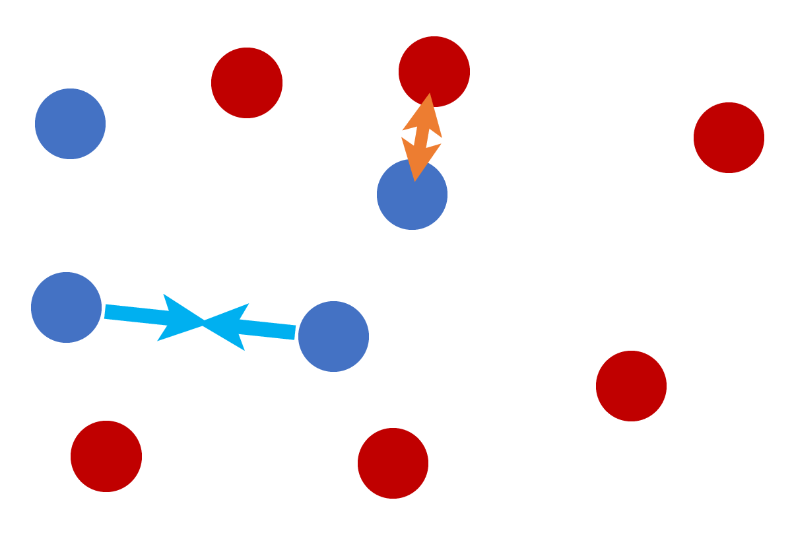 | 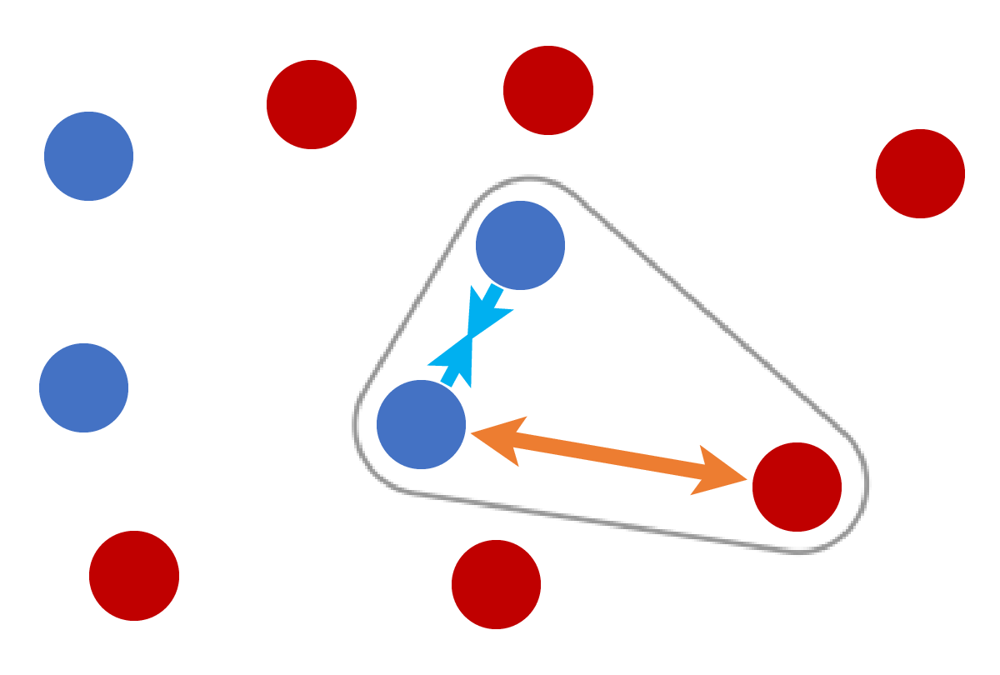 | 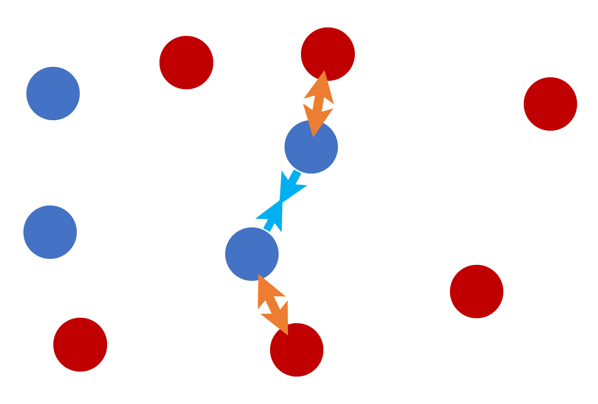  | 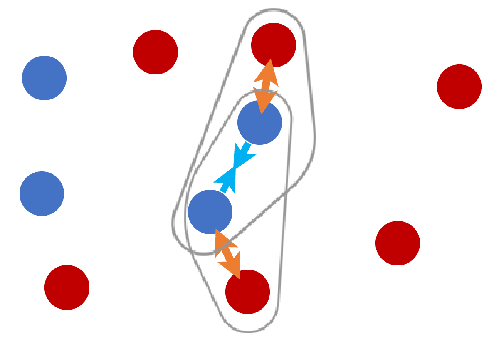 |

*Sampling and negative-mining strategy for each method. Blue: positives, Red: Negatives. Traditional contrastive and triplet losses use random sampling. Our hardest-contrastive and hardest-triplet losses use the hardest negatives.*

Please refer to our [ICCV'19 paper](https://node1.chrischoy.org/data/publications/fcgf/fcgf.pdf) for more details.


### Visualization of FCGF

We color-coded FCGF features for pairs of 3D scans that are 10m apart for KITTI and a 3DMatch benchmark pair for indoor scans. FCGF features are mapped to a scalar space using t-SNE and colorized with the Spectral color map.

| KITTI LIDAR Scan 1   | KITTI LIDAR Scan 2   |
|:--------------------:|:--------------------:|
| 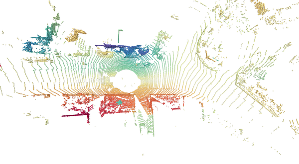 | 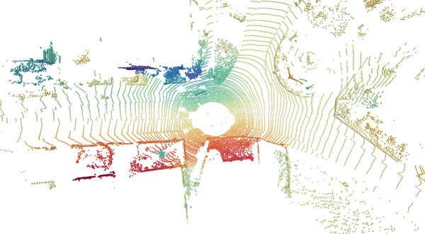 |

| Indoor Scan 1              | Indoor Scan 2              |
|:--------------------------:|:--------------------------:|
| 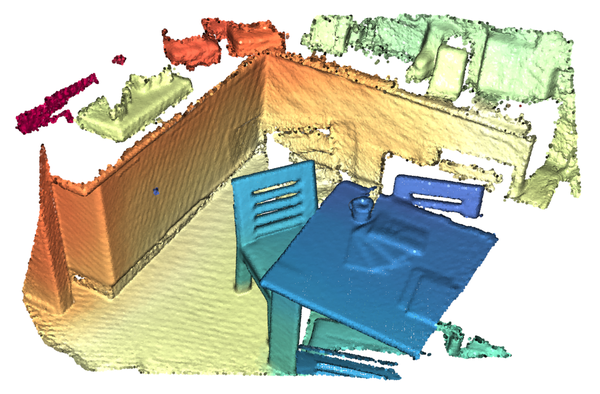 | 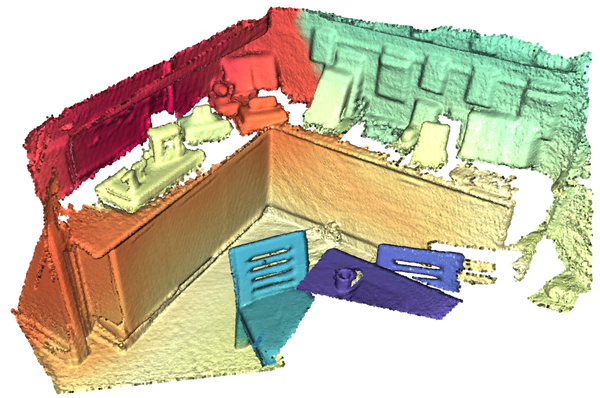 |

#### FCGF Correspondence Visualizations

Please follow the link [Youtube Video](https://www.youtube.com/watch?v=d0p0eTaB50k) or click the image to view the YouTube video of FCGF visualizations.
[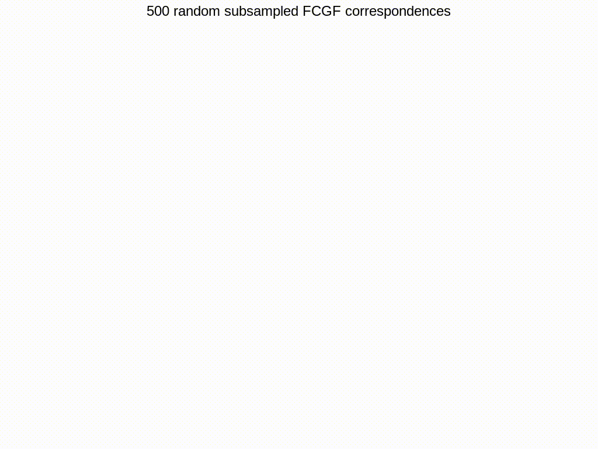](https://www.youtube.com/watch?v=d0p0eTaB50k)

## WarpConvNet backend

FCGF runs on **[WarpConvNet](https://github.com/NVlabs/WarpConvNet)**
instead of MinkowskiEngine. The sparse-convolutional `ResUNetBN2C` descriptor
network is now maintained inside WarpConvNet and imported directly:

```python
from warpconvnet.models.fcgf import ResUNetBN2C
model = ResUNetBN2C(in_channels=1, out_channels=32,
                    normalize_feature=True, conv1_kernel_size=7)
```

The original MinkowskiEngine checkpoints in the [Model Zoo](#model-zoo) are
still usable — convert them once with `wcn/convert_me_to_wcn.py` (WarpConvNet and
MinkowskiEngine store the K³ conv kernel in a transposed spatial order, which the
converter handles). All WarpConvNet-native training / eval / demo code lives in
`wcn/`.

## Requirements

- Linux x86_64, CUDA 12.x, Python 3.10–3.12, PyTorch 2.x
- [WarpConvNet](https://github.com/NVlabs/WarpConvNet) (provides `warpconvnet.models.fcgf`) — installs from a prebuilt wheel, no compilation
- `torch_scatter`, `scipy`, `numpy` (+ `plyfile` for the 3DMatch benchmark, `open3d` for the demo viz)

> The legacy MinkowskiEngine code paths (`model/`, `lib/`, `scripts/`) are kept
> for reference; the maintained path is the WarpConvNet one under `wcn/`.

## Installation & Dataset Download

[WarpConvNet](https://github.com/NVlabs/WarpConvNet) ships **prebuilt binary wheels** (no compilation), so setup is one shot.
Pick the wheel matching your PyTorch / CUDA / Python from the
[WarpConvNet releases](https://github.com/NVlabs/WarpConvNet/releases). A
known-good, broadly-compatible combo (Ampere/Ada/Hopper):

```bash
# 1. PyTorch 2.5 + CUDA 12.4
pip install torch==2.5.1 --index-url https://download.pytorch.org/whl/cu124

# 2. WarpConvNet prebuilt wheel (torch 2.5 / cu124 / Python 3.12; swap cp312 for your Python)
pip install https://github.com/NVlabs/WarpConvNet/releases/download/v1.7.11/warpconvnet-1.7.11+torch2.5cu124-cp312-cp312-linux_x86_64.whl

# 3. FCGF + remaining deps
git clone https://github.com/chrischoy/FCGF.git && cd FCGF
pip install scipy plyfile                 # + open3d for the demo viz
pip install torch-scatter -f https://data.pyg.org/whl/torch-2.5.1+cu124.html
```

For a newer stack (incl. Blackwell), use the `torch2.10cu128` or `torch2.11cu130`
wheels instead — the asset name encodes `+torch<ver>cu<cuda>-cp<python>`. Verify with:

```bash
python -c "from warpconvnet.models.fcgf import ResUNetBN2C; print('WarpConvNet FCGF OK')"
```

For training, download the preprocessed 3DMatch benchmark dataset. The dataset is
hosted on Hugging Face: [chrischoy/FCGF-3DMatch](https://huggingface.co/datasets/chrischoy/FCGF-3DMatch).

```
./scripts/download_datasets.sh /path/to/dataset/download/dir
```

This downloads the data into `/path/to/dataset/download/dir/threedmatch`. Alternatively,
you can fetch it directly with the Hugging Face CLI:

```
hf download chrischoy/FCGF-3DMatch --repo-type dataset --local-dir /path/to/dataset/download/dir
```

For KITTI training, follow the instruction on [KITTI Odometry website](http://www.cvlibs.net/datasets/kitti/eval_odometry.php) to download the KITTI odometry training set.


## Demo: Extracting and color coding FCGF

Download an original checkpoint, convert it to the [WarpConvNet](https://github.com/NVlabs/WarpConvNet) model, and run the
demo — copy-paste:

```bash
# 1. Download a pretrained FCGF checkpoint (3DMatch, 32-dim) from the Model Zoo
wget https://huggingface.co/chrischoy/FCGF/resolve/main/2019-08-19_06-17-41.pth -O fcgf-3dmatch.pth

# 2. Convert the MinkowskiEngine weights to the WarpConvNet model (kernel transpose + name remap)
python wcn/convert_me_to_wcn.py --me_ckpt fcgf-3dmatch.pth --out fcgf-3dmatch-wcn.pth

# 3. Extract + color-code + visualize features on a kitchen scene
python demo.py -m fcgf-3dmatch-wcn.pth
```

`demo.py` accepts either the converted checkpoint (step 2) or an original ME
checkpoint directly (it converts on load); running `python demo.py` with no args
downloads and converts a default model for you. The demo extracts FCGF features,
color-codes them independent of spatial location (t-SNE), and visualizes them.

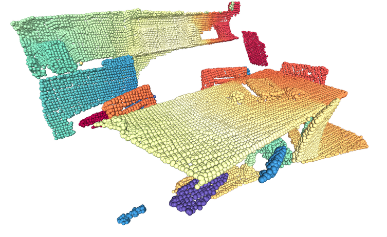

*You may have to rotate the scene to get the above visualization.*


## Training and running the 3DMatch benchmark

Train the [WarpConvNet](https://github.com/NVlabs/WarpConvNet)-native model with hardest-contrastive loss:

```
python wcn/train.py \
    --root /path/to/threedmatch \
    --config_dir ./config \
    --out_dir ./outputs/3dmatch \
    --batch_size 4 --voxel_size 0.025 --conv1_kernel_size 7 --max_epoch 100
```

Feature-Match-Recall benchmark (extract features on the test fragments, then evaluate):

```
python wcn/eval_3dmatch.py --extract  --model ./outputs/3dmatch/model_best.pth \
    --source /path/to/threedmatch_test --target ./features_tmp --voxel_size 0.025
python wcn/eval_3dmatch.py --evaluate \
    --source /path/to/threedmatch_test --target ./features_tmp --num_keypoints 5000
```

To evaluate an original MinkowskiEngine checkpoint, first convert it:

```
python wcn/convert_me_to_wcn.py --me_ckpt 2019-08-19_06-17-41.pth --out wcn-3dmatch-32feat.pth
```

## Using the model directly

```python
import torch
from warpconvnet.models.fcgf import ResUNetBN2C
from warpconvnet.geometry.types.voxels import Voxels

model = ResUNetBN2C(in_channels=1, out_channels=32,
                    normalize_feature=True, conv1_kernel_size=7).cuda().eval()

coords = torch.floor(xyz / 0.025).int()             # [N, 3] voxel coords
feats  = torch.ones((len(coords), 1))               # 1-D occupancy
vox = Voxels([coords], [feats]).to("cuda")
descriptors = model(vox).feature_tensor             # [N, 32], L2-normalized
```

See `wcn/features.py::extract_features` for the full voxelize→forward helper.

## KITTI Odometry

KITTI pretrained weights are in the [Model Zoo](#model-zoo) and load into the same
`ResUNetBN2C` (via `wcn/convert_me_to_wcn.py`, `conv1_kernel_size=5`, `voxel_size=0.3`).
The [WarpConvNet](https://github.com/NVlabs/WarpConvNet)-native KITTI data pipeline is a work in progress; for now use the
legacy `lib/data_loaders.py` (MinkowskiEngine) as the reference implementation.


## Model Zoo

Weights are hosted on Hugging Face: [chrischoy/FCGF](https://huggingface.co/chrischoy/FCGF).

| Model       | Normalized Feature  | Dataset | Voxel Size    | Feature Dimension | Performance                | Link   |
|:-----------:|:-------------------:|:-------:|:-------------:|:-----------------:|:--------------------------:|:------:|
| ResUNetBN2C | True                | 3DMatch | 2.5cm (0.025) | 32                | FMR: 0.9578 +- 0.0272      | [download](https://huggingface.co/chrischoy/FCGF/resolve/main/2019-08-19_06-17-41.pth) |
| ResUNetBN2C | True                | 3DMatch | 2.5cm (0.025) | 16                | FMR: 0.9442 +- 0.0345      | [download](https://huggingface.co/chrischoy/FCGF/resolve/main/2019-09-18_14-15-59.pth) |
| ResUNetBN2C | True                | 3DMatch | 5cm   (0.05)  | 32                | FMR: 0.9372 +- 0.0332      | [download](https://huggingface.co/chrischoy/FCGF/resolve/main/2019-08-16_19-21-47.pth) |
| ResUNetBN2C | False               | KITTI   | 20cm  (0.2)   | 32                | RTE: 0.0534m, RRE: 0.1704° | [download](https://huggingface.co/chrischoy/FCGF/resolve/main/2019-07-31_19-30-19.pth) |
| ResUNetBN2C | False               | KITTI   | 30cm  (0.3)   | 32                | RTE: 0.0607m, RRE: 0.2280° | [download](https://huggingface.co/chrischoy/FCGF/resolve/main/2019-07-31_19-37-00.pth) |
| ResUNetBN2C | True                | KITTI   | 30cm  (0.3)   | 16                | RTE: 0.0670m, RRE: 0.2295° | [download](https://huggingface.co/chrischoy/FCGF/resolve/main/KITTI-v0.3-ResUNetBN2C-conv1-5-nout16.pth) |
| ResUNetBN2C | True                | KITTI   | 30cm  (0.3)   | 32                | RTE: 0.0639m, RRE: 0.2253° | [download](https://huggingface.co/chrischoy/FCGF/resolve/main/KITTI-v0.3-ResUNetBN2C-conv1-5-nout32.pth) |


## Raw Data for FCGF Figure 4

- [Distance threshold data](https://raw.githubusercontent.com/chrischoy/FCGF/master/assets/fig4_dist_thresh.txt)
- [Inlier threshold data](https://raw.githubusercontent.com/chrischoy/FCGF/master/assets/fig4_inlier_thresh.txt)


## Citing FCGF

FCGF will be presented at ICCV'19: Friday, November 1, 2019, 1030–1300 Poster 4.1 (Hall B)

```
@inproceedings{FCGF2019,
    author = {Christopher Choy and Jaesik Park and Vladlen Koltun},
    title = {Fully Convolutional Geometric Features},
    booktitle = {ICCV},
    year = {2019},
}
```

## Related Projects

- A neural network library for high-dimensional sparse tensors: [Minkowski Engine, CVPR'19](https://github.com/StanfordVL/MinkowskiEngine)
- Semantic segmentation on a high-dimensional sparse tensor: [4D Spatio Temporal ConvNets, CVPR'19](https://github.com/chrischoy/SpatioTemporalSegmentation)
- The first fully convolutional metric learning for correspondences: [Universal Correspondence Network, NIPS'16](https://github.com/chrischoy/open-ucn)
- 3D Registration Network with 6-dimensional ConvNets: [Deep Global Registration, CVPR'20](https://github.com/chrischoy/DeepGlobalRegistration)


## Projects using FCGF

- Gojcic et al., [Learning multiview 3D point cloud registration, CVPR'20](https://arxiv.org/abs/2001.05119)
- Choy et al., [Deep Global Registration, CVPR'20 Oral](https://arxiv.org/abs/2004.11540)


## Acknowledgements

We want to thank all the ICCV reviewers, especially R2, for suggestions and valuable pointers.
